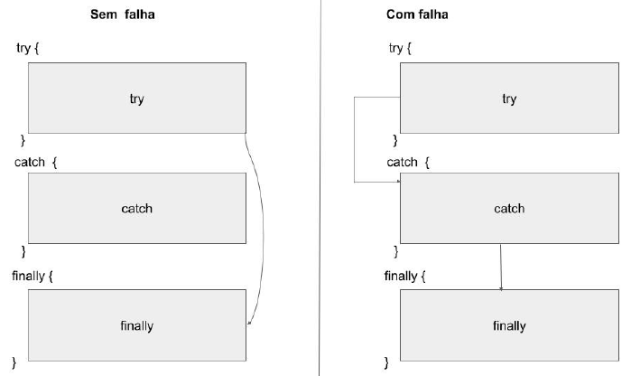

# Enunciado das Questões

## Questão 1

Evolua a LI1 de modo a prover o comando do Stm while Exp, alterando o arquivo Interpreter.hs. Tal comando é semelhante ao while Exp Stm, mas com a diferença de executar o comando Stm pelo menos uma vez e checar a condição Exp somente após a execução de tal comando. É fundamental estudar a estrutura do programa definida no arquivo AbsLI.hs, que já conterá a representação do comando do Stm while Exp com o construtor de tipo SdoWhile seguido de Stm e Exp. No arquivo TestesQ1.hs, há exemplos de programas de entradas e saídas esperadas. Você não deve alterar os arquivos AbsLI.hs.

## Questão 2
A linguagem LI1' no arquivo Interpreter.hs evolui a LI1 com suporte a Strings e concatenação de Strings. Evolua a LI1' de forma a prover expressões Booleanas e as operações lógicas and, or, e not. Inicialmente, estude o arquivo AbsLI.hs, e note que ele já tem novos construtores do tipo referentes a tais operações e aos literais True e False. Em seguida, altere a função eval no arquivo Interpreter.hs de forma a avaliar expressões correspondentes a tais construtores.

Observe as dicas e comentários no arquivo Interpreter.hs. No arquivo TestesQ2.hs, há exemplos de programas de entradas e saídas esperadas. Você não deve alterar o arquivo AbsLI.hs.

## Questão 3
Note que, na LI1, um programa em que haja expressão com denominador nulo termina abruptamente. Evolua a LI1 para que a avaliação de expressões considere apenas divisão por números diferentes de zero. Assim, caso o denominador numa expressão de divisão seja nulo, deve-se retornar Left "divisao por 0", e esse retorno deve ser repassado pela cadeia de chamada de funções; caso contrário, faz-se a divisão e o resultado inteiro é retornado como argumento do construtor Right. Reflita sobre o impacto dessa mudança nas funções eval, execute, e executeP, redefinindo-as conforme necessário. Entres outras mudanças, essas funções deverão ter os seguintes tipos:

```
executeP :: RContext -> Program -> Either ErrorMessage RContext
execute :: RContext -> Stm -> Either ErrorMessage RContext
eval :: RContext -> Exp -> Either ErrorMessage Integer
```

onde ErrorMessage é definido como String, o que já é fornecido no arquivo Interpreter.hs.

Observe as dicas e edite o arquivo Interpreter.hs. No arquivo TestesQ3.hs, há exemplos de programas de entradas e saídas esperadas. Você não deve alterar o arquivo AbsLI.hs .

## Questão 4
Evolua a linguagem resultante da Questão 3 de forma a implementar o comando try catch finally, comum a algumas linguagens como Java, PHP, e Python. A semântica (comportamento) do comando 

`try stmsT catch stmsC finally stmsF` 

é a seguinte:

- inicia-se executando sequencialmente a lista de comandos de stmsT;
- se algum deles falhar, e apenas se isso ocorrer, devem-se executar sequencialmente:
    1. a lista de comandos stmsC, utilizando-se o contexto imediatamente antes de o comando falhar;
    2. a lista de comandos stmsF;
- se nenhum comando de stmsT falhar, passa-se diretamente à execução dos comandos de stmsF, ignorando-se os de stmsC.

Note, portanto, que os comandos de stmsF são sempre executados, e que os de stmsC apenas se houver falha em algum de stmsT. A figura abaixo ilustra o fluxo de controle desejado:



O arquivo AbsLI.hs define a estrutura da nova linguagem, contendo uma alternativa na definição do tipo algébrico Stm (o construtor de tipo STry seguido de três listas de comandos) para representar o comando try catch finally. Assim, no arquivo Interpreter.hs, utilize padrões apropriados para definir o comportamento desse novo comando. No arquivo TestesQ4.hs, há exemplos de programas de entradas e saídas esperadas. Você não deve alterar o arquivo AbsLI.hs.

## Questão 5
Evolua a LI1 de forma a prover todas as features (funcionalidades) solicitadas nas questões anteriores. Ou seja, em relação à LI1, a nova linguagem deve prover expressões e operações com Strings e valores booleanos, comando do Stm while Exp, comando try catch finally, e avaliação de expressões com possíveis erros (como divisão por zero). O arquivo AbsLI.hs define a estrutura da linguagem.

O arquivo Interpreter.hs  contem o mínimo de código necessário para compilar os testes. Edite-o, possivelmente adaptando o código das questões anteriores. No arquivo TestesQ5.hs, há exemplos de programas de entradas e saídas esperadas. Você não deve alterar o arquivo AbsLI.hs.
